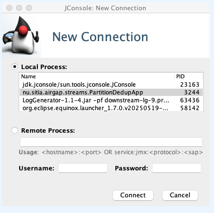
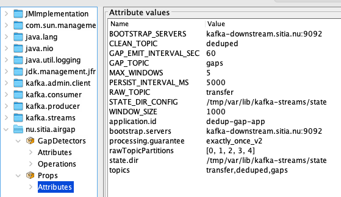
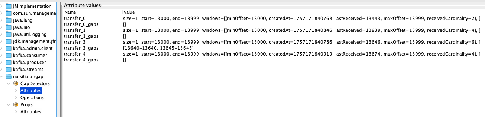
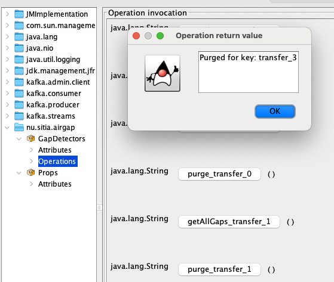
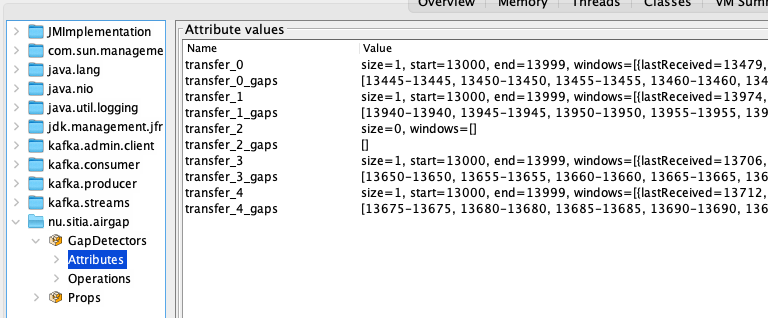

# Deduplication and gap detection

## Quick Start

1. **Build everything:**
    ```sh
    make
    ```
    This builds both the Go and Java deduplication applications. The Java fat JAR will be in `java-streams/target/air-gap-deduplication-fat-<version>.jar`.

2. **Set up your environment variables:**
    Create a `.env` file or export variables in your shell. Example:
    ```sh
    export WINDOW_SIZE=1000
    export MAX_WINDOWS=10
    export RAW_TOPICS=transfer
    export CLEAN_TOPIC=output
    export GAP_TOPIC=gaps
    export BOOTSTRAP_SERVERS=localhost:9092
    export STATE_DIR_CONFIG=/tmp/dedup_state_a/
    export GAP_EMIT_INTERVAL_SEC=60
    export PERSIST_INTERVAL_MS=10000
    ```

3. **Start the deduplication service:**
    ```sh
    java -jar java-streams/target/air-gap-deduplication-fat-<version>.jar
    ```

4. **Monitor and manage:**
    - Use JMX (e.g., `jconsole`) to inspect state, gaps, and configuration at runtime.
    - Check logs for progress and troubleshooting.

---

## Environment Variables

| Variable                | Description                                                        | Example Value                |
|-------------------------|--------------------------------------------------------------------|------------------------------|
| `WINDOW_SIZE`           | Number of events each window can hold                              | `1000`                       |
| `MAX_WINDOWS`           | Maximum number of windows to keep in memory                        | `10`                         |
| `RAW_TOPICS`            | Input topic to read from. See the documentation on Redundancy and Load Balancing for more details | `transfer`                   |
| `CLEAN_TOPIC`           | Output topic for deduplicated events                               | `output`                     |
| `GAP_TOPIC`             | Topic to write gaps to                                             | `gaps`                       |
| `BOOTSTRAP_SERVERS`     | Kafka connection URL                                               | `localhost:9092`             |
| `STATE_DIR_CONFIG`      | Path to writable directory for local state                         | `/tmp/dedup_state_a/`        |
| `GAP_EMIT_INTERVAL_SEC` | How often to emit gaps to GAP_TOPIC (in seconds)                   | `60`                         |
| `PERSIST_INTERVAL_MS`   | How often to sync local state with Kafka (in milliseconds)         | `10000`                      |


One of the benefits of this software is that, ideally, it should be able to support exactly-once-delivery. Since upstream can be configured to send the same events several times, we need a mechanism to de-duplicate the received data stream. 

The data stream works like this:


Events from Kafka upstream are read by upstream and sent via UDP do downstream. Downstream will write the events to Kafka downstream with the same topic name and partition as Kafka upstream has. The order of events and keys are changed. The keys downstream will be a triple: <topic>_<partition>_<offset> where the values are taken from Kafka upstream.

## Deduplication
Deduplication is performed by inspecting each event in the downstream receive topic. Details of how the Gap detector functions are given below. The topic name, partition and offset are used in the GapDetector code to get one of the following results:
- 0 - the offset is the expected offset for this partition and the event is safe to forward
- positive - the offset is larger than the expected offset for this partition but hasn't been seen before so it's safe to forward
- 0 - the offset is less than the expected offset for this partition but hasn't yet been delivered so it's safe to forward
- negative - the offset has already been delivered for this partition. Do not forward this event. It's a duplicate

Deduplication is performed by a Java Kafka Streams application, and is reading the Kafka topic that Kakfa downstreams wrote, performing deduplication and it finally writes the output to another topic in the same Kafka instance.


Each deduplication instance handles one or more partitions of the received topic. For best performance, start at least as many deduplication instances as there are partitions in the received topic, but a few extra is recommended. If you use fewer instances than partitions the deduplication will still function - the running instances will share the load so some might get more than one partition to handle. The instances are started for a specific topic, but are assigned one or more partitions from Kafka when they register. When an event is delivered to the deduplication it checks its internal state. The state consists of `nextExpectedId` and zero or more gaps (first missing id, last missing id).

* If the next id equals nextExpectedId, this is the expected event. Increase nextExpectedId and return 'Ok to deliver''
* If the next id is less than nextExpectedId, it may be a duplicate or a previously missing event. Check the gap list. If the next id is within any gap, update the gap list and return 'Ok to deliver'. If the next id is not in the gap list, it's already delivered. Return 'Do not deliver'.
* If the next id is greater than nextExpectedId, then we haven't seen this before. Create a new gap (nextExpectedId, (next id -1)), update nextExpectedId to next id + 1 and return 'Ok to deliver'

The deduplication instances will read events from (one or more) its assigned partition(s). For each partition we have a Gap state with the nextExpectedId and a data structure that contain received events. The state is saved in Kafka every now and then (configurable) so in case of node crash, another thread can pick up approximate where the previous node were and continue. The state is also stored locally on each node for faster access and just synchronized with Kafka for high availability.

If the worst happens, we will lose some work for a partition. This means that a lot of events can be delivered (or marked as missing) before the new node takes over. The new node will mark the entire block as missing, resulting in a large gap. This may cause resending of data and duplicates in the deduplicated Kafka topic."

To be able to know what events are delivered, we use a Sliding Window set of Roaring64NavigableMap. Think of a RoaringMap as a bitmap, where each bit represents an event. If an event has been delivered, we set the corresponding bit. Checking or setting a bit is a very fast operation. We then use a sliding window setup, so if an item is received that is outside of the current window, we do the following:
* Create a new window where we can put newer events than the ones from the current window
* Check if we have more windows than max configured. If so:
    - Run a method on the oldest window, sending all gaps to a gap topic
    - Remove the oldest window
* Mark the received event in the new window.

Each deduplicator instance uses RAM to hold its state. If we have:
* x number of events per second (eps)
* d number of days we would like to keep in memory at the same time
* m MB RAM required

Then the RAM required for this state is:
$$
m = x * 3,600 * 24 * d * 0.125 / (1024 * 1024)
$$

Example: we have 30 days of 10.000 eps
$$
m = 10,000 * 3,600 * 24 * 30 * 0.125 / (1024 * 1024) = 3,089MB
$$

If there are 10 partitions and 12 deduplicator instances, each instance should be configured for approximately 300MB of RAM (plus additional memory for the rest of the application).

This is a worst-case scenario (e.g., every other event is missing). Normally, RAM usage is much lower due to bitmap compression.

#### Number of Windows and Window size
It might be tempting to configure 30 windows, each covering a full day. However, it's better to use thousands or tens of thousands of smaller windows for better bitmap efficiency. The bitmap algorithm will work better on average size maps.

### Kafka Offset Number Rollover
In the unlikely case the Kafka partition offset should roll over, all gaps and states must be reset. This is, however, very unlikey. Kafka stores offsets as a 64 bit signed integer. This means that offsets can be 0 to $2^{63} - 1$, or 0 to +9,223,372,036,854,775,807. Negative offsets don't exists.

If Kafka receives 100.000 events each second, then a potential roll-over will occur after:
$$
Years = \frac{2^{63}-1}{100000 \cdot 3600 \cdot 24 \cdot 365.2425} ≈ 2 922 770
$$

This calculation takes into account leap years but not leap seconds, since they have a tiny impact on the result.

So, given that number of events, we have almost 3 million years before we get a number rollover. When that happens, we can change the topic names for the transport and dedup topics and restart the services. 

The dedup Java application uses the Java long primitive type, which is also a 64 bit signed integer, just like the Kafka offset data type.

## Gap detection
Gap detection is the ability to detect missing events. We use gap as a notation for one or more consecutive missing events. One missing event is denoted [n-n], example: [42-42] meaning that one event with id 42 is missing. Several consecutive missing events can be bundled together as: [n-m], example: [42-75] meaning that all events from 42 to 75 are missing.

Gap detection can be performed on the Roaring bitmaps effectively. This is performed:
* When a window is about to get deleted
* Once every (configurable) second.

When a window is about to get deleted, all the gaps in that window are sent to the gap topic. The deduplicator will accept any event older than the oldest event in the oldest window, so this is the last chance to deliver those events. 

Periodically (configurable), all gaps are extracted for all partitions. Gaps are compared with all gaps for the last time this was run and all gaps that are present in the last run and in this run will be written to the gap topic.

Resend bundles can be created from the gap topic to get the missing events delivered once more (more on that in the Resend documentation).

### A little more depth in Gap Detection
The application contains two important configurations: WINDOW_SIZE and MAX_WINDOWS. When the very first event is processed, now window is created. The software calculates a window so the received event is within that window. The window beginning and end is aligned with the WINDOW_SIZE, so for example if the size is 1000, then a start window for an event with offset: 5499 will be 5000-5999. With that window, a "beginning of all events" is set to the received event, and also a "last received number" is set to the same value. The roaming bitmap is also updated to reflect that the received event has been seen.

When subsequent events are received, we use the windows we have to search for the event. If we have seen the event earlier, we discard the event. If not, we deliver the event to the output topic and updates the bitmap. If the event has an offset smaller than the very first window, we just deliver the event without setting any bit (the bitmaps can only grow upwards). If the offset is larger than the end of the last window, we create a new window.

Before we create the new window, we check if we already have MAX_WINDOWS windows loaded. In that case we write all the gaps from the oldest window and then we discard that window, freeing up space for the new window.

## Build
To build the thin and fat JAR: run `mvn clean package` from the java-streams directory (output in java-streams/target/), or just run make in the root directory.
The fat JAR will contain all dependencies and is runnable with java -jar target/java-streams-fat-<version>.jar.

The make file in the root will also perform a `mvn clean package` when building the golang applications.

## Configuration
Configuration of the dedup application can only be done with environment variables. The following variables are configurable:
Data storage:
* WINDOW_SIZE - How many events each window should be able to hold.
* MAX_WINDOWS - How many windows the application can keep in memory.

Topics:
* RAW_TOPICS - The input topic(s) to read from.
* CLEAN_TOPIC - The topic to write the deduplicated events to. Note that this must have at least the same number of partitions as the number of active deduplication processes. Best practice is to set the Upstream Transfer topic, the Downstram Transfer topic (RAW_TOPICS) and the deduplicated topic (CLEAN_TOPIC) to have the same number of partitions.
* GAP_TOPIC - Topic to write gaps to. This will be used when creating resend bundles.

Kafka:
* BOOTSTRAP_SERVERS - The Kafka connection url.

State:
* STATE_DIR_CONFIG - Path to a writable directory to store cached data. Each instance you start must have its own STATE_DIR_CONFIG.

Timers:
* GAP_EMIT_INTERVAL_SEC - How often to check and output gaps to GAP_TOPIC. In production, set this to hours. In test environments, more frequent intervals are acceptable.
* PERSIST_INTERVAL_MS - How often should we synchronize the local state with Kafka so another instance can continue if this instance goes down? If the interval is short and a lot of gaps has been seen, then this can affect performance and ultimately may crash the application. If the interval is too long, we will get a lot of duplicates if this instance crashes and another instance is taking over the workload.

## Running from the command line
The Java application is built with the make command in the root of air-gap. That will build both the Java application and all golang applications. The Java application is written to `java-streams/target`

Before you start the deduplicator you will probably want to add a configuration (test values, not for production):
```
WINDOW_SIZE=1000
MAX_WINDOWS=10
RAW_TOPICS=transfer
CLEAN_TOPIC=output
GAP_TOPIC=gaps
BOOTSTRAP_SERVERS=192.168.153.148:9092
STATE_DIR_CONFIG=/tmp/dedup_state_a/
GAP_EMIT_INTERVAL_SEC=60
PERSIST_INTERVAL_MS=10000
```

The command to start the deduplicator is:
```
java -jar java-streams/target/air-gap-deduplication-fat-0.1.0-SNAPSHOT.jar
```

## Configuring Logging

The Java deduplication service uses SLF4J with log4j2 for logging. You can configure logging by adding a `log4j2.xml` file and change the startup parameters to use that file instead of the default one (in the resources directory in the jar file).

## Logging to Daily Log Files with Log4j2

To configure the deduplication application to use Log4j2 and create a new log file for each day, follow these steps:

### 1. Add Log4j2 Dependencies
The project is built with log4j2 support.

### 2. Create a Log4j2 Configuration File

There is a `log4j2.xml` file provided in the application's classpath (in `src/main/resources/`). For custom logging, use this example and save as a xml file in the file system. When starting the application (in the .service-file), add `-Dlog4j.configurationFile=` to the startup line.

```sh
java -Dlog4j.configurationFile=/etc/airgap/dedup/log4j2.xml -jar java-streams/target/air-gap-deduplication-fat-0.1.3-SNAPSHOT.jar
```

```xml
<?xml version="1.0" encoding="UTF-8"?>
<Configuration status="WARN">
  <Appenders>
    <RollingFile name="FileAppender"
                 fileName="/var/log/airgap/dedup/dedup.log"
                 filePattern="/var/log/airgap/dedup/dedup-%d{yyyy-MM-dd}.log.gz">
      <PatternLayout pattern="%d{yyyy-MM-dd HH:mm:ss} %-5p %c{1}:%L - %m%n"/>
      <Policies>
        <TimeBasedTriggeringPolicy interval="1" modulate="true"/>
      </Policies>
    </RollingFile>
    <Console name="Console" target="SYSTEM_OUT">
      <PatternLayout pattern="%d{yyyy-MM-dd HH:mm:ss} %-5p %c{1}:%L - %m%n"/>
    </Console>
  </Appenders>
  <Loggers>
    <Root level="info">
      <AppenderRef ref="FileAppender"/>
      <AppenderRef ref="Console"/>
    </Root>
  </Loggers>
</Configuration>
```

- This configuration writes logs to `/var/log/airgap/dedup/dedup.log` and rolls over to a new file each day, compressing old logs as `.gz` files.
- Adjust the `fileName` and `filePattern` as needed for your environment.

### 3. Run the Application

No code changes are needed if you use SLF4J for logging. Log4j2 will be picked up automatically if it is on the classpath and `log4j2.xml` is present.

### 4. Log Directory

Ensure the `/var/log/airgap/dedup/` directory exists or is writable by the user running the application.

### 5. Multiple Instances

If you run multiple instances on the same host, set a unique log file name per instance (e.g., using an environment variable or JVM property):

```sh
fileName="logs/dedup-${env:INSTANCE_ID}.log"
filePattern="logs/dedup-${env:INSTANCE_ID}-%d{yyyy-MM-dd}.log.gz"
```
And set `INSTANCE_ID` in each service's environment.

---

## Running deduplication as a Service

To run the deduplication app as a background service on Linux, you can use `systemd`.

### Example: Create a systemd service

1. **Create a service file:**
    ```sh
    sudo nano /etc/systemd/system/air-gap-dedup.service
    ```

2. **Paste the following (edit paths and environment as needed):**
    ```ini
    [Unit]
    Description=Air Gap Deduplication Service
    After=network.target

    [Service]
    Type=simple
    WorkingDirectory=/path/to/air-gap
    ExecStart=/usr/bin/java -jar /path/to/air-gap/air-gap-deduplication-fat-<version>.jar
    EnvironmentFile=/path/to/air-gap/dedup.env
    Restart=on-failure
    User=airgap

    [Install]
    WantedBy=multi-user.target
    ```

    - Replace `/path/to/air-gap` with your actual project directory.
    - Set the correct JAR version.
    - Create a `dedup.env` file with your environment variables (see above).
    - Set `User=airgap` to a non-root user that owns the files.

3. **Reload systemd and start the service:**
    ```sh
    sudo systemctl daemon-reload
    sudo systemctl start air-gap-dedup
    sudo systemctl enable air-gap-dedup
    ```

4. **Check status and logs:**
    ```sh
    sudo systemctl status air-gap-dedup
    journalctl -u air-gap-dedup -f
    ```

This will keep the deduplication app running in the background and restart it on failure.

## Running Multiple Deduplication Service Instances

To efficiently run several deduplication service instances (e.g., to match the number of Kafka partitions), use a systemd template service and per-instance environment files.

### 1. Create a systemd template service file

Save as `/etc/systemd/system/dedup@.service`:

```ini
[Unit]
Description=Air Gap Deduplication Service Instance %i
After=network.target

[Service]
Type=simple
WorkingDirectory=/path/to/air-gap
ExecStart=/usr/bin/java -jar /path/to/air-gap/java-streams/target/air-gap-deduplication-fat-<version>.jar
# If using several instances
#ExecStart=/usr/bin/java $JAVA_OPTS -jar /opt/airgap/dedup/air-gap-deduplication-fat-<version>.jar
# If using several instances and different log files for the instances
#ExecStart=/usr/bin/java $JAVA_OPTS -Dlog4j.configurationFile=/etc/airgap/dedup/log4j2.xml -jar /opt/airgap/dedup/air-gap-deduplication-fat-<version>.jar
EnvironmentFile=/path/to/air-gap/dedup-%i.env
Restart=on-failure
User=airgap

[Install]
WantedBy=multi-user.target
```

- Replace `/path/to/air-gap` and `<version>` as needed.
- Each instance will use its own environment file: `dedup-1.env`, `dedup-2.env`, etc.

### 2. Create environment files for each instance

Example: `/path/to/air-gap/dedup-1.env`, `/path/to/air-gap/dedup-2.env`, ...

Each file should set a unique `STATE_DIR_CONFIG` and any other per-instance settings.

### 3. Start and enable multiple instances

```sh
sudo systemctl daemon-reload
sudo systemctl start air-gap-dedup@1
sudo systemctl start air-gap-dedup@2
# ... up to as many as you want
sudo systemctl enable air-gap-dedup@1
sudo systemctl enable air-gap-dedup@2
# ...
```

Check status/logs for each instance with:
```sh
sudo systemctl status air-gap-dedup@1
journalctl -u air-gap-dedup@2 -f
```

This approach is scalable and easy to automate for any number of deduplication service instances.

### Setting Java Heap Size

To control the Java heap size for each deduplication service, set the minimum and maximum heap values using the `JAVA_OPTS` environment variable in your per-instance environment file, or directly in the systemd service file.

**Option 1: In your environment file (recommended)**

Add to each `dedup-<n>.env`:
```
JAVA_OPTS="-Xms512m -Xmx2g"
```
Then, in your systemd service file, update `ExecStart` to:
```
ExecStart=/usr/bin/java $JAVA_OPTS -jar /path/to/air-gap/java-streams/target/air-gap-deduplication-fat-<version>.jar
```

**Option 2: Directly in the service file**

Set the heap size in the `ExecStart` line:
```
ExecStart=/usr/bin/java -Xms512m -Xmx2g -jar /path/to/air-gap/java-streams/target/air-gap-deduplication-fat-<version>.jar
```

Adjust the values (`-Xms` for minimum, `-Xmx` for maximum) as needed for your workload and available memory.

## Checking internal state of a detector
The dedup application exposes a few attributes to JMX. To start the JMX console, make sure Java is installed and execute this in a new termnial:
```
jconsole
```
Here, choose the PartitionDedupApp and click on connect.


Choose `Insecure connection`, then click on MBeans. Expand the folder: `nu.sitia.airgap`

There's a Props Attributes setting that shows the current configuration of the application:


You can also check what gaps each partition currently have:


And if you need to, you can also purge a GapDetector (remove gaps and state)


Here, the transfer_2 is purged. Previosly it also contained every 5:th event offset, like the other partitions.


Don't purge data in a production environment. This will remove the state that tracks what has been delivered and thus what we are missing. This is a development and test feature.

----


## Error messages

### OutOfMemoryError
If the deduplicator tries to allocate memory for a window and fails, it will try to remove the oldest window and then retry the operation. Regardless of the outcome, the following message will be logged, both to the log file and to the deduplication topic.
```
OutOfMemoryError while emitting gaps for purged window. Consider increasing MAX_WINDOWS or reducing WINDOW_SIZE.
```
The message will also include some more details regarding the error.
